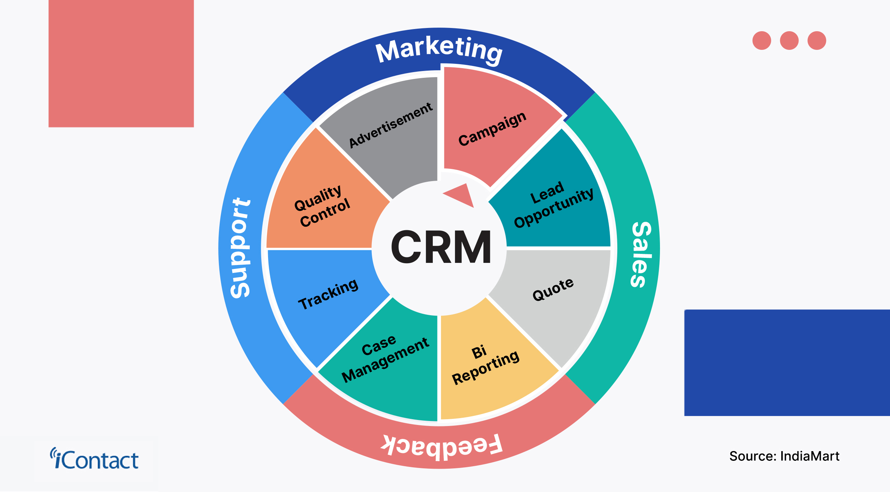

## Hi, I’m Muhammed Mustafa Morad  

  

  
  
  
  

---

### 🧠 About Me

I'm an AI Engineer passionate about merging artificial intelligence with software development and data analytics to build smart and scalable solutions. I specialize in using Python and its ecosystem to build ML models, analyze data, and develop AI-driven solutions in computer vision, NLP, and predictive modeling.

---

## 🛠️ Technical Skills   

### 👨‍💻 Languages

### 📚 Frameworks & Libraries

### 🛠️ Tools & Platforms

### 🧠 Databases

---

### 📚 Education & Certifications

- 🎓 **B.A. in English** – Kafr El-Sheikh University
  
- 💡 **CS50’s Introduction to Computer Science** – Harvard University

- 📘 **Machine Learning Specialization** – DeepLearning.AI

- 🧠 **Machine Learning with Python** – IBM  

- 🧠 **Advanced Learning Algorithms** – DeepLearning.AI  

- 💡 **Python for Data Science, AI & Development** – IBM  

- 📘 **Database Fundamentals** – MaharaTech  
 
- 💻 **Git and GitHub Practical Course** – Udemy
  
- 🔐 **Cyber Security for AI** – MaharaTech  
 
- 📊 **Career Essentials in Data Analysis** – Microsoft & LinkedIn  

---

## 📂 My Projects

#### 📦 Customer Service Management System

Our system delivers streamlined product management with precise order tracking and automated expense calculation, saving you valuable time and effort. It also offers clear customer review analysis and a fast, intuitive interface designed for everyone.

**Tech Stack:** HTML5, CSS3, JavaScript, Python, Django  
🔗 [View Project](https://www.linkedin.com/posts/mohamed-mustafa-morad_%D9%88%D9%82%D9%84-%D9%B1%D8%B9%D9%85%D9%84%D9%88%D8%A7-%D9%81%D8%B3%D9%8A%D8%B1%D9%89-%D9%B1%D9%84%D9%84%D9%87-%D8%B9%D9%85%D9%84%D9%83%D9%85-activity-7267571904117407744-C9PY?utm_source=share&utm_medium=member_desktop&rcm=ACoAAD54VvYBG_1crNgCQRvyS0WasyvNOF19C7Q) 
🔗 [GitHub Repo](https://github.com/Mohamedmorad2/Customer-Service-Management-System)

---

#### 📊 Salaries Data Analysis

This project analyzes a dataset containing detailed information on San Francisco city government employee compensation—covering job titles, departments, base salaries, overtime, and benefits. The analysis reveals trends such as skewed salary distributions.

**Tech Stack:** Python, Pandas, NumPy, Seaborn, Matplotlib  
🔗 [View Project](https://salaries-analysis-report.streamlit.app) 
🔗 [GitHub Repo](https://github.com/Mohamedmorad2/Salaries-Data-Analysis)

---

#### 🏠 House Prices Prediction

About This project aims to predict house prices based on various features such as area, number of bedrooms, bathrooms, access to main road, and more. The model uses linear regression and standard scaling for input data.

**Tech Stack:** Python, Scikit-learn, Pandas, NumPy, Matplotlib  
🔗 [View Project](https://house-prices-predictions.streamlit.app)
🔗 [GitHub Repo](https://github.com/Mohamedmorad2/House-Prices-Predictions)

---

#### 🛍️ Egypt’s Fashion Sales Analysis

Egypt’s Premier Fashion Sales Analysis is a data-driven project that provides interactive sales insights using Streamlit, Power BI, and Pandas. It analyzes sales trends, customer behaviors, and product performance while offering real-time dashboards and downloadable reports. helping businesses make informed, data-driven decisions.

**Tech Stack:** Python, Pandas, NumPy, Seaborn, Matplotlib, Streamlit  
🔗 [View Project](https://egypt-premier-fashion-sales-analysis.streamlit.app) 
🔗 [GitHub Repo](https://github.com/Mohamedmorad2/Egypt-Premier-Fashion-Sales-Analysis)

---

  

---

